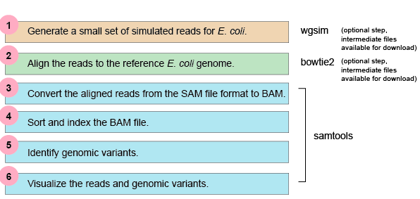
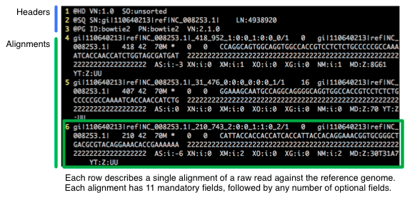
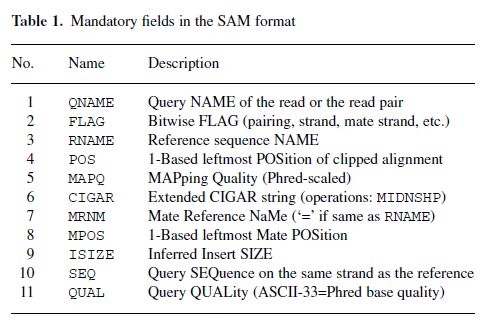
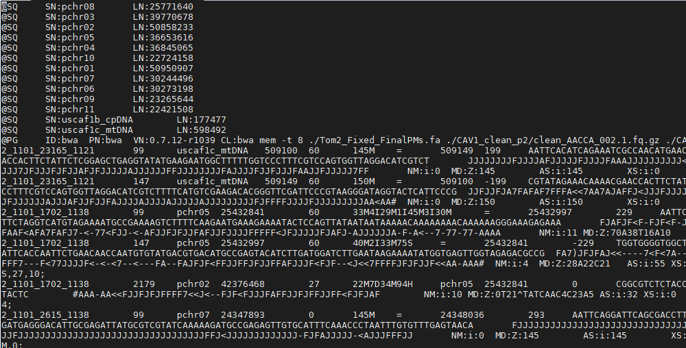
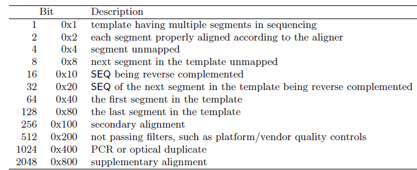
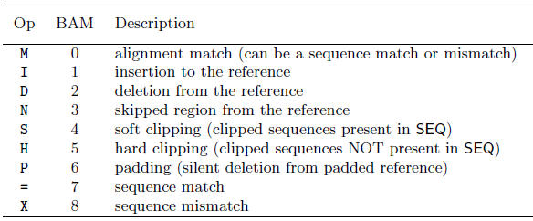

# SAMtools- SAM and BAM Files

General Workflow for NGS analysis;



- SAM (Sequence Alignment/Map) format is the unified format for storing read alignments to a reference sequence
- BAM (Binary Alignment/Map) are compressed SAMs (binary, not human-readable). They can be indexed to allow rapid extraction of information, so alignment viewers do not need to uncompress the whole BAM file in order to look at information for a particular coordinate range, somewhere in the file.

General view of SAM files with Headers and Alignments sections; 




These are mandatory fields in the SAM format;





These are the descriptions for the FLAG tags;



These are the descriptions for the CIGAR string;



## HANDS- ON

1) Copy the tutorial material

```
cp -r /cta/users/smengi/SamTools-Tutorial SamTools-Tutorial
```

2) Unzip the .gz files in Samtool-Tutorial directory

```
sbatch gunzip.sh
```
3) To open commands about Samtools
```
samtools
```
4) Convert the .sam file to .bam file
```
sbatch Samtools_view.sh
```
5) To see the data about alignment
```
samtools flagstat clean_AAGGA_007.bam
```
6) To sort the .bam file
```
sbatch Samtools_sorted.sh
```
7) To index the .sorted.bam file
```
samtools index clean_AAGGA_007.sorted.bam
```
8) To see specific regions on the chromosomes
```
samtools view clean_AAGGA_007.sorted.bam "pchr05:10000-20000"
```

# A Further Step
- Do you want to detect SNPs or heterogeneity by using SAMtools? ,but HOW?
  
_Answer_:

 Open samtools commands and See "phase heterozygotes" command. Then;

 ```
 samtools phase clean_AAGGA_007.sorted.bam > output.txt
```

## REFERENCES

- Li H., Handsaker B.*, Wysoker A., Fennell T., Ruan J., Homer N., Marth G., Abecasis G., Durbin R. and 1000 Genome Project Data Processing Subgroup (2009) The Sequence alignment/map (SAM) format and SAMtools. Bioinformatics, 25, 2078-9. [PMID: 19505943]
- UCD Bioinformatics Core RNA-Seq Workshop. Retrieved 5 March 2020, from https://ucdavis-bioinformatics-training.github.io/2019_August_UCD_mRNAseq_Workshop/data_reduction/filetypes
- For SAM Flags;
  
  Explain SAM Flags. Retrieved 6 March 2020, from https://broadinstitute.github.io/picard/explain-flags.html 

- For MAPing Quality;
   
   Li, H., Ruan, J., & Durbin, R. (2008). Mapping short DNA sequencing reads and calling variants using mapping quality scores. Genome research, 18(11), 1851–1858. https://doi.org/10.1101/gr.078212.108

